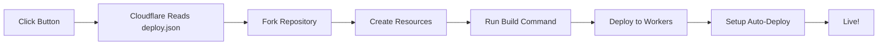

# 🎉 One-Click Deploy Feature Summary

Your template now has a **professional one-click deployment button** similar to Vercel, Netlify, and other platforms!

## ✨ What's New

### 1. **Deploy Button in README**

Located at the top of README.md with badges:

- []
- []
- Status badges (License, Node, pnpm)

### 2. **Quick Deploy Section**

Three deployment options:

- **Option 1**: One-click deploy to Cloudflare (fastest)
- **Option 2**: Use as GitHub template
- **Option 3**: Clone and deploy manually

### 3. **Visual Workflow Diagram**

- Located at `public/deploy-workflow.png`
- Shows the 5-step deployment process
- Embedded in README with expandable details

### 4. **Deployment Configuration**

- **File**: `.cloudflare/deploy.json`
- Defines build commands, resources, and setup steps
- Enables automatic resource creation

### 5. **Comprehensive Documentation**

- **`.cloudflare/ONE_CLICK_DEPLOY.md`**: Detailed deployment guide
- **`DEPLOY.md`**: Full deployment documentation
- **`.github/AUTO_DEPLOY.md`**: Auto-deploy feature overview

### 6. **Validation Workflow** (Optional)

- **File**: `.github/workflows/validate-deploy.yml.example`
- Validates deploy configuration on every push
- Ensures deploy button always works

## 📁 New Files Created

```
📦 better-auth-cloudflare-tanstack-start/
├── 📄 README.md (updated)
│   ├── Deploy buttons at top
│   ├── Quick Deploy section
│   └── Visual workflow diagram
├── 📁 .cloudflare/
│   ├── 📄 deploy.json (Cloudflare deploy config)
│   └── 📄 ONE_CLICK_DEPLOY.md (Deployment guide)
├── 📁 public/
│   └── 🖼️ deploy-workflow.png (Visual diagram)
└── 📁 .github/workflows/
    └── 📄 validate-deploy.yml.example (Config validator)
```

## 🚀 How It Works

### User Journey

1. **User visits your GitHub repo**
2. **Sees the "Deploy to Cloudflare" button**
3. **Clicks the button**
4. **Cloudflare deployment wizard opens**:
   - Forks the repository
   - Connects to Cloudflare account
   - Creates D1, KV, R2 resources
   - Builds and deploys the app
5. **App is live in 3-5 minutes!** 🎉

### Technical Flow



## 🎯 Benefits

### For Template Users

- ✅ **Zero configuration** - Just click and deploy
- ✅ **Automatic resource creation** - No manual setup needed
- ✅ **Instant preview** - See the app running immediately
- ✅ **CI/CD included** - Auto-deploy on every push

### For You (Template Maintainer)

- ✅ **Professional appearance** - Looks like a production-ready template
- ✅ **Lower barrier to entry** - More users will try your template
- ✅ **Better documentation** - Clear deployment options
- ✅ **Validation** - Ensure deploy config stays valid

## 📝 Configuration Details

### deploy.json Structure

```json
{
  "name": "Project name",
  "type": "javascript",
  "build": {
    "command": "Build command",
    "cwd": "./",
    "watch_paths": ["src/**/*"]
  },
  "env": {
    "SECRET_NAME": {
      "type": "secret",
      "description": "Description for users"
    }
  },
  "resources": {
    "d1_databases": [...],
    "kv_namespaces": [...],
    "r2_buckets": [...]
  },
  "setup": {
    "steps": [...]
  }
}
```

## 🔧 Customization

### Update Repository URL

Replace `YOUR_USERNAME` in README.md with your actual GitHub username:

```bash
# Find and replace
sed -i '' 's/YOUR_USERNAME/your-actual-username/g' README.md
```

### Customize Resource Names

Edit `.cloudflare/deploy.json`:

```json
{
  "resources": {
    "d1_databases": [
      {
        "binding": "DATABASE",
        "name": "your-custom-db-name", // ← Change this
        "description": "Your description"
      }
    ]
  }
}
```

### Add More Environment Variables

```json
{
  "env": {
    "YOUR_SECRET": {
      "type": "secret",
      "description": "Description shown to users"
    }
  }
}
```

## 🎨 Visual Assets

### Deploy Workflow Diagram

- **Location**: `public/deploy-workflow.png`
- **Size**: Optimized for web
- **Usage**: Embedded in README
- **Can be replaced**: Yes, just update the image file

### Badges

All badges are from shields.io and are automatically updated:

- License badge
- Node version badge
- pnpm version badge

## 📊 Comparison with Other Platforms

| Feature               | Cloudflare  | Vercel     | Netlify    |
| --------------------- | ----------- | ---------- | ---------- |
| **One-click deploy**  | ✅          | ✅         | ✅         |
| **Edge deployment**   | ✅          | ✅         | ✅         |
| **Database included** | ✅ (D1)     | ❌         | ❌         |
| **KV storage**        | ✅          | ✅         | ❌         |
| **Object storage**    | ✅ (R2)     | ❌         | ❌         |
| **Free tier**         | ✅ Generous | ✅ Limited | ✅ Limited |

## 🆘 Troubleshooting

### Deploy Button Not Working

**Check**:

1. Is `deploy.json` valid JSON?
2. Are all required scripts in `package.json`?
3. Is the repository URL correct?

**Validate**:

```bash
# Validate JSON
jq empty .cloudflare/deploy.json

# Check scripts
jq '.scripts' package.json
```

### Resources Not Created

**Solution**: Use the setup script instead:

```bash
pnpm setup:cloudflare
```

### Build Fails

**Check**:

1. Does `pnpm build` work locally?
2. Are all dependencies in `package.json`?
3. Check Cloudflare deployment logs

## 📚 Learn More

- [Cloudflare Deploy Documentation](https://deploy.workers.cloudflare.com/)
- [Workers Documentation](https://developers.cloudflare.com/workers/)
- [Better Auth Documentation](https://better-auth.com/)

## 🎓 Best Practices

### For Template Maintainers

1. **Keep deploy.json updated** when you change build process
2. **Test the deploy button** regularly
3. **Document environment variables** clearly
4. **Provide troubleshooting guides**

### For Template Users

1. **Read the deployment guide** before clicking
2. **Have Cloudflare account ready**
3. **Generate secrets beforehand**
4. **Test locally first** if possible

## 💡 Tips

- **Marketing**: The deploy button makes your template look professional
- **SEO**: Badges and clear deployment options improve discoverability
- **User Experience**: One-click deploy reduces friction significantly
- **Maintenance**: Validation workflow ensures button stays functional

## 🎉 Success Metrics

After adding the deploy button, you should see:

- ✅ More stars on GitHub
- ✅ More forks and deployments
- ✅ Fewer "how to deploy" issues
- ✅ Better user onboarding experience

---

**Your template is now production-ready with professional deployment options!** 🚀
